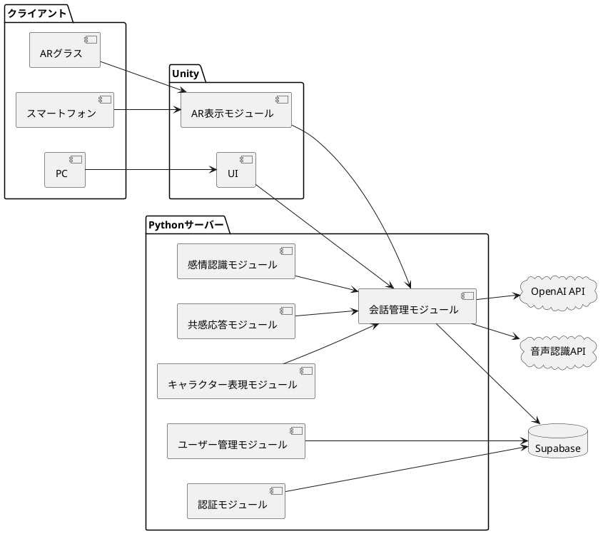
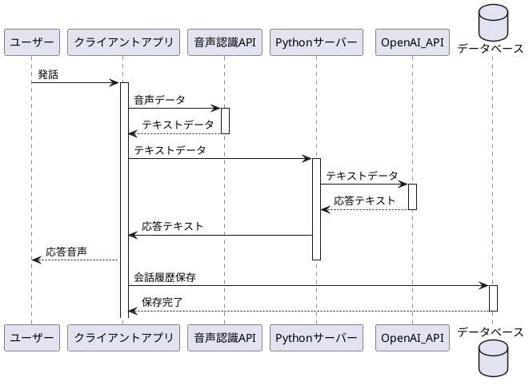
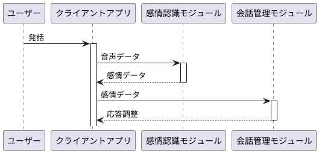
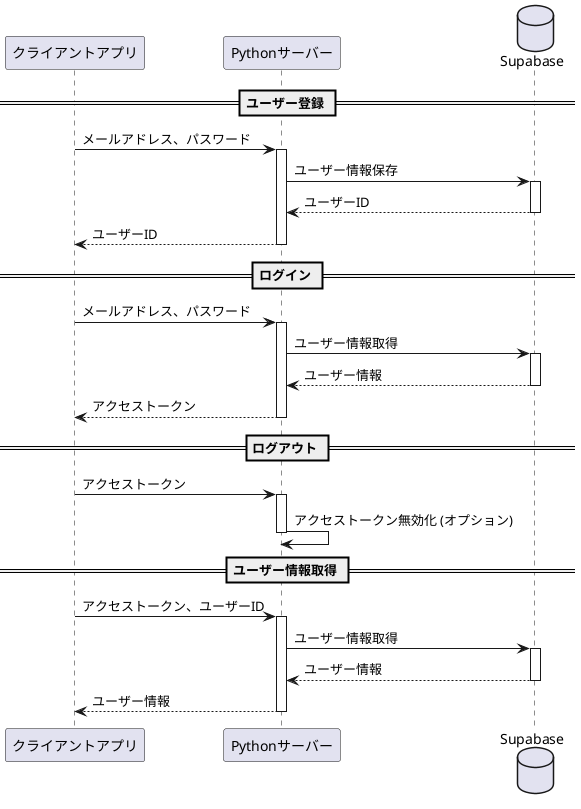

# 詳細設計書

## プロジェクト名

AI Friend - 愛嬌とユーモアのあるパーソナルAI

## 1. システムアーキテクチャ

システムの全体構成を示す。

## 2. 各機能の詳細設計

### 2.1 会話機能

* **モジュール:** 会話管理モジュール
* **処理フロー:**
    1. ユーザーの発話を音声認識API（Azure Cognitive Services for Speech または OpenAI Whisper）でテキストに変換する。
    2. 変換されたテキストをOpenAI API (GPTモデル) に送信し、応答を生成する。
    3. 生成された応答をテキストから音声に変換し、ユーザーに提示する。
    4. 会話履歴をデータベースに保存する。
* **データ:** 会話履歴データ

### 2.2 感情認識機能

* **モジュール:** 感情認識モジュール
* **処理フロー:**
    1. ユーザーの発話音声を分析し、声質、トーン、内容から感情を抽出する。
    2. 抽出された感情に基づいて、会話管理モジュールに応答の調整を指示する。
* **データ:** 感情分析モデル

### 2.3 共感機能

* **モジュール:** 共感応答モジュール
* **処理フロー:**
    1. 会話内容と感情認識結果を基に、共感的な応答を生成する。
    2. 適切な相槌や質問を生成し、会話の流れを円滑にする。
* **データ:** 共感表現パターン

### 2.4 愛嬌とユーモア

* **モジュール:** キャラクター表現モジュール
* **処理フロー:**
    1. 会話の流れや文脈に応じて、冗談やユーモアのある応答を生成する。
    2. 個性的な口癖や話し方を適用する。
* **データ:** キャラクター設定データ、ユーモア表現パターン

### 2.5 AR表示機能

* **モジュール:** AR表示モジュール
* **処理フロー:**
    1. Unityで作成されたAIフレンドの3Dモデルをロードする。
    2. ARCore/ARKitを用いて、現実空間を認識し、AIフレンドを配置する。
    3. ユーザーの操作に応じて、AIフレンドの移動やアニメーションを制御する。
* **データ:** AIフレンド3Dモデル、アニメーションデータ

### 2.7 ユーザー管理機能

#### 2.7.1 ユーザー登録

* **モジュール:** ユーザー管理モジュール
* **処理フロー:**
    1. ユーザーからメールアドレスとパスワードを受け取る。
    2. メールアドレスの形式とパスワードの強度を検証する。
    3. パスワードをハッシュ化してデータベースに保存する。
    4. ユーザーIDを生成し、クライアントに返す。
* **データ:** ユーザー情報 (user_id, email, password_hash)
* **API設計:**
    * **エンドポイント:** `/register`
    * **メソッド:** POST
    * **リクエスト:** `{ "email": "string", "password": "string" }`
    * **レスポンス:** `{ "user_id": "string" }`

#### 2.7.2 ログイン

* **モジュール:** 認証モジュール
* **処理フロー:**
    1. ユーザーからメールアドレスとパスワードを受け取る。
    2. データベースからユーザー情報を取得する。
    3. 入力されたパスワードとハッシュ化されたパスワードを比較する。
    4. 認証に成功した場合、アクセストークン（JWT）を生成してクライアントに返す。
* **データ:** ユーザー情報 (user_id, email, password_hash)
* **API設計:**
    * **エンドポイント:** `/login`
    * **メソッド:** POST
    * **リクエスト:** `{ "email": "string", "password": "string" }`
    * **レスポンス:** `{ "access_token": "string" }`

#### 2.7.3 ログアウト

* **モジュール:** 認証モジュール
* **処理フロー:**
    1. クライアントからアクセストークンを受け取る。
    2. アクセストークンを無効化する（オプション）。
* **データ:** アクセストークン
* **API設計:**
    * **エンドポイント:** `/logout`
    * **メソッド:** POST
    * **リクエスト:** `Authorization: Bearer <access_token>`
    * **レスポンス:** (204 No Content)

#### 2.7.4 ユーザー情報取得

* **モジュール:** ユーザー管理モジュール
* **処理フロー:**
    1. クライアントからユーザーIDを受け取る。
    2. データベースからユーザー情報を取得する。
    3. ユーザー情報をクライアントに返す。
* **データ:** ユーザー情報 (user_id, email)
* **API設計:**
    * **エンドポイント:** `/users/{user_id}`
    * **メソッド:** GET
    * **リクエスト:** `Authorization: Bearer <access_token>`
    * **レスポンス:** `{ "user_id": "string", "email": "string" }`

### 2.8 データベース設計

* **テーブル:**
    * `users`: ユーザー情報 (user_id, email, password, google_id)
    * `conversations`: 会話履歴 (conversation_id, user_id, timestamp)
    * `messages`: メッセージ内容 (message_id, conversation_id, sender, content, timestamp)

## 3. API設計

### 3.1 会話API

* **エンドポイント:** `/chat`
* **メソッド:** POST
* **リクエスト:** `{ "user_id": "string", "message": "string" }`
* **レスポンス:** `{ "response": "string" }`

### 3.2 感情認識API

* **エンドポイント:** `/analyze_emotion`
* **メソッド:** POST
* **リクエスト:** `{ "audio": "binary" }`
* **レスポンス:** `{ "emotion": "string" }`

## 4. モジュール構成

* **会話管理モジュール:**
    * 会話機能
* **感情認識モジュール:**
    * 感情認識機能
* **共感応答モジュール:**
    * 共感機能
* **キャラクター表現モジュール:**
    * 愛嬌とユーモア
* **AR表示モジュール:**
    * AR表示機能
* **ユーザー管理モジュール:**
    * ユーザー登録
    * ユーザー情報取得
* **認証モジュール:**
    * ログイン
    * ログアウト

## 5. データフロー

### 5.1 会話機能

1. ユーザーの発話は、クライアントアプリケーションで録音されます。
2. 録音された音声データは、音声認識API（Azure Cognitive Services for Speech または OpenAI Whisper）に送信されます。
3. 音声認識APIは、音声データをテキストデータに変換し、サーバーに送信します。
4. サーバーは、テキストデータをOpenAI API (GPTモデル) に送信し、応答を生成します。
5. 生成された応答は、テキストデータとしてサーバーからクライアントアプリケーションに送信されます。
6. クライアントアプリケーションは、テキストデータを音声合成APIで音声データに変換し、ユーザーに提示します。
7. 会話の内容（ユーザーの発話とAIの応答）は、会話履歴としてデータベースに保存されます。

### 5.2 感情認識機能

1. ユーザーの発話は、クライアントアプリケーションで録音されます。
2. 録音された音声データは、感情認識モジュールに送信されます。
3. 感情認識モジュールは、音声データを分析し、ユーザーの感情を抽出します。
4. 抽出された感情データは、会話管理モジュールに送信されます。
5. 会話管理モジュールは、感情データに基づいて、OpenAI APIへのリクエスト内容や応答を調整します。

### 5.3 ユーザー管理機能

1. ユーザー登録時、クライアントアプリケーションからメールアドレスとパスワードがサーバーに送信されます。
2. サーバーは、メールアドレスの形式とパスワードの強度を検証し、パスワードをハッシュ化してデータベースに保存します。
# 詳細設計書

## プロジェクト名

AI Friend - 愛嬌とユーモアのあるパーソナルAI

## 1. システムアーキテクチャ

システムの全体構成を示す。

## 2. 各機能の詳細設計

### 2.1 会話機能

* **モジュール:** 会話管理モジュール
* **処理フロー:**
    1. ユーザーの発話を音声認識API（Azure Cognitive Services for Speech または OpenAI Whisper）でテキストに変換する。
    2. 変換されたテキストをOpenAI API (GPTモデル) に送信し、応答を生成する。
    3. 生成された応答をテキストから音声に変換し、ユーザーに提示する。
    4. 会話履歴をデータベースに保存する。
* **データ:** 会話履歴データ

### 2.2 感情認識機能

* **モジュール:** 感情認識モジュール
* **処理フロー:**
    1. ユーザーの発話音声を分析し、声質、トーン、内容から感情を抽出する。
    2. 抽出された感情に基づいて、会話管理モジュールに応答の調整を指示する。
* **データ:** 感情分析モデル

### 2.3 共感機能

* **モジュール:** 共感応答モジュール
* **処理フロー:**
    1. 会話内容と感情認識結果を基に、共感的な応答を生成する。
    2. 適切な相槌や質問を生成し、会話の流れを円滑にする。
* **データ:** 共感表現パターン

### 2.4 愛嬌とユーモア

* **モジュール:** キャラクター表現モジュール
* **処理フロー:**
    1. 会話の流れや文脈に応じて、冗談やユーモアのある応答を生成する。
    2. 個性的な口癖や話し方を適用する。
* **データ:** キャラクター設定データ、ユーモア表現パターン

### 2.5 AR表示機能

* **モジュール:** AR表示モジュール
* **処理フロー:**
    1. Unityで作成されたAIフレンドの3Dモデルをロードする。
    2. ARCore/ARKitを用いて、現実空間を認識し、AIフレンドを配置する。
    3. ユーザーの操作に応じて、AIフレンドの移動やアニメーションを制御する。
* **データ:** AIフレンド3Dモデル、アニメーションデータ

### 2.7 ユーザー管理機能

#### 2.7.1 ユーザー登録

* **モジュール:** ユーザー管理モジュール
* **処理フロー:**
    1. ユーザーからメールアドレスとパスワードを受け取る。
    2. メールアドレスの形式とパスワードの強度を検証する。
    3. パスワードをハッシュ化してデータベースに保存する。
    4. ユーザーIDを生成し、クライアントに返す。
* **データ:** ユーザー情報 (user_id, email, password_hash)
* **API設計:**
    * **エンドポイント:** `/register`
    * **メソッド:** POST
    * **リクエスト:** `{ "email": "string", "password": "string" }`
    * **レスポンス:** `{ "user_id": "string" }`

#### 2.7.2 ログイン

* **モジュール:** 認証モジュール
* **処理フロー:**
    1. ユーザーからメールアドレスとパスワードを受け取る。
    2. データベースからユーザー情報を取得する。
    3. 入力されたパスワードとハッシュ化されたパスワードを比較する。
    4. 認証に成功した場合、アクセストークン（JWT）を生成してクライアントに返す。
* **データ:** ユーザー情報 (user_id, email, password_hash)
* **API設計:**
    * **エンドポイント:** `/login`
    * **メソッド:** POST
    * **リクエスト:** `{ "email": "string", "password": "string" }`
    * **レスポンス:** `{ "access_token": "string" }`

#### 2.7.3 ログアウト

* **モジュール:** 認証モジュール
* **処理フロー:**
    1. クライアントからアクセストークンを受け取る。
    2. アクセストークンを無効化する（オプション）。
* **データ:** アクセストークン
* **API設計:**
    * **エンドポイント:** `/logout`
    * **メソッド:** POST
    * **リクエスト:** `Authorization: Bearer <access_token>`
    * **レスポンス:** (204 No Content)

#### 2.7.4 ユーザー情報取得

* **モジュール:** ユーザー管理モジュール
* **処理フロー:**
    1. クライアントからユーザーIDを受け取る。
    2. データベースからユーザー情報を取得する。
    3. ユーザー情報をクライアントに返す。
* **データ:** ユーザー情報 (user_id, email)
* **API設計:**
    * **エンドポイント:** `/users/{user_id}`
    * **メソッド:** GET
    * **リクエスト:** `Authorization: Bearer <access_token>`
    * **レスポンス:** `{ "user_id": "string", "email": "string" }`

### 2.8 データベース設計

* **テーブル:**
    * `users`: ユーザー情報 (user_id, email, password, google_id)
    * `conversations`: 会話履歴 (conversation_id, user_id, timestamp)
    * `messages`: メッセージ内容 (message_id, conversation_id, sender, content, timestamp)

## 3. API設計

### 3.1 会話API

* **エンドポイント:** `/chat`
* **メソッド:** POST
* **リクエスト:** `{ "user_id": "string", "message": "string" }`
* **レスポンス:** `{ "response": "string" }`

### 3.2 感情認識API

* **エンドポイント:** `/analyze_emotion`
* **メソッド:** POST
* **リクエスト:** `{ "audio": "binary" }`
* **レスポンス:** `{ "emotion": "string" }`

## 4. モジュール構成

* **会話管理モジュール:**
    * 会話機能
* **感情認識モジュール:**
    * 感情認識機能
* **共感応答モジュール:**
    * 共感機能
* **キャラクター表現モジュール:**
    * 愛嬌とユーモア
* **AR表示モジュール:**
    * AR表示機能
* **ユーザー管理モジュール:**
    * ユーザー登録
    * ユーザー情報取得
* **認証モジュール:**
    * ログイン
    * ログアウト

## 5. データフロー

### 5.1 会話機能

1. ユーザーの発話は、クライアントアプリケーションで録音されます。
2. 録音された音声データは、音声認識API（Azure Cognitive Services for Speech または OpenAI Whisper）に送信されます。
3. 音声認識APIは、音声データをテキストデータに変換し、サーバーに送信します。
4. サーバーは、テキストデータをOpenAI API (GPTモデル) に送信し、応答を生成します。
5. 生成された応答は、テキストデータとしてサーバーからクライアントアプリケーションに送信されます。
6. クライアントアプリケーションは、テキストデータを音声合成APIで音声データに変換し、ユーザーに提示します。
7. 会話の内容（ユーザーの発話とAIの応答）は、会話履歴としてデータベースに保存されます。

### 5.2 感情認識機能

1. ユーザーの発話は、クライアントアプリケーションで録音されます。
2. 録音された音声データは、感情認識モジュールに送信されます。
3. 感情認識モジュールは、音声データを分析し、ユーザーの感情を抽出します。
4. 抽出された感情データは、会話管理モジュールに送信されます。
5. 会話管理モジュールは、感情データに基づいて、OpenAI APIへのリクエスト内容や応答を調整します。

### 5.3 ユーザー管理機能

1. ユーザー登録時、クライアントアプリケーションからメールアドレスとパスワードがサーバーに送信されます。
2. サーバーは、メールアドレスの形式とパスワードの強度を検証し、パスワードをハッシュ化してデータベースに保存します。
3. ログイン時、クライアントアプリケーションからメールアドレスとパスワードがサーバーに送信されます。
4. サーバーは、データベースに保存されているハッシュ化されたパスワードと、送信されたパスワードを比較し、認証を行います。
5. 認証に成功した場合、サーバーはアクセストークン（JWT）を生成し、クライアントアプリケーションに送信します。
6. ログアウト時、クライアントアプリケーションからアクセストークンがサーバーに送信されます。
7. サーバーは、アクセストークンを無効化します。
8. ユーザー情報取得時、クライアントアプリケーションからアクセストークンとともにユーザーIDがサーバーに送信されます。
9. サーバーは、アクセストークンを検証し、データベースからユーザー情報を取得し、クライアントアプリケーションに送信します。
